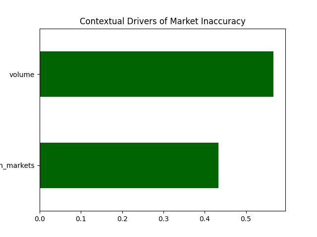
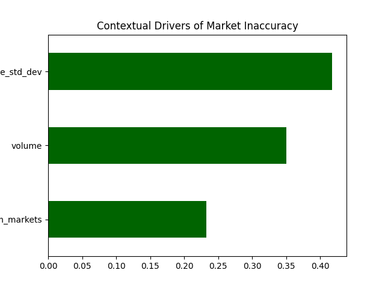

# Go with the safe bet - a Polymarket analysis

Launched in June of 2020, Polymarket has taken off in popularity. As of April 2026, the market reports [just under 700k monthly users](https://tokenterminal.com/explorer/projects/polymarket/metrics/user-mau), though it remains geo-blocked by several countries (including the UK) due to regulations.

## What is Polymarket, and how does it work?

Polymarket is essentially a stock market in which one buys a share in a ‘Yes’ or ‘No’ prediction, rather than a share in a company. Each question posed is marked as an event, and each ‘Yes’ or ‘No’ option within said event is a market. Another way to think of a market is as a question. As this blog is considering the outcome of elections, an event could be 'Who will win election A?', and the markets would be 'Person_X will win' (Yes/No) and 'Person_Y will win' (Yes/No.)

The price of a "Yes" share or a "No" share always ranges between $0.01 and $0.99. If your prediction was correct, you receive a payout of $1 for each share purchased in that market. Due to the payout being strictly capped at $1.00, the current price of a share naturally translates into a percentage probability. Upon the understanding that thousands of people are risking their money on these predictions, then, it should follow that the percentage equivalent of the price (e.g., 80% probability if the price settles at $0.80 per share), is the real-time probability of that outcome actualising. 

## Purpose of the blog?

The purpose of this blog and project is to explore the lifecycle of accuracy in Polymarket's predictions, particularly in relation to election-related events. How accurate is Polymarket, and at what point does it become accurate? Which variables does Polymarket rely on most to make accurate predictions?

## Where do we start?

Before delving into the graphs that provide insight to the questions above, I must clarify the definition of market certainty. Market certainty, in this blog, refers to the point in time when the outcome of a prediction market is effectively known, even if the market has not yet officially resolved. That is to say, the point at which the price of a 'Yes' share is equal to $0.99.

By anchoring time to the moment of certainty, rather than just the end date of the event, we can get a much clearer picture of when the market effectively “figured out” the outcome, because prices past this point are no longer meaningful forecasts, and can distort measures of calibration, efficiency, and market behaviour.

Because this data is based purely on elections, it is safe to assume that participants actually have a general idea of when market certainty will be reached, as polling and vote results will come through before the actual outcome is announced.

### Calibration curves and kernel density estimations

One tool which can be used to gain insight to the lifecycle of accuracy in Polymarket's predictions is a calibration curve. A perfectly calibrated market, in this case, follows 45-degree dashed line (at which point Polymarket’s predicted outcome is equal to the actual outcome i.e. if a market price (predicted probability) is 0.70, the event should occur exactly 70% of the time in the real world). 

Above, is a visualisation of the market’s actual performance as shown by the blue line. 

The significant erraticism of the blue line 6 months from market certainty suggests a lack of trade. This volatility suggests that six months prior to an event’s close, the market struggles significantly with price discovery. This is due to a severe lack of events, and the reason for this is explained below when considering the limitations of this analysis.

As we move to the data from 1-month and 1-week before market certainty for election related events, the blue line begins to hug the diagonal line much more tightly, representing not just an increase in events and data points, but also the market learning how to predict more accurately. In the 1-week graph, accuracy is high across almost all price bins.
 
You’ll also notice the purple shaded area on the graph. This is a kernel density plot showing exactly where the 'money' is being placed by traders. 

In this six-month snapshot, there is a massive concentration of volume near the zero-point, indicating that a substantial portion of early market activity is dominated by "long-shot" bets on unlikely outcomes. This distribution highlights a speculative environment where traders are more willing to risk capital on extreme probabilities before more refined data begins to narrow the price toward the centre. A smaller secondary peak of volume appears around the 0.4 to 0.5 price range, representing the 'money' entering "toss-up" events.

The final calibration graph, taken 1 day before certainty, follows a similar pattern to those above.

Even 1-day before market certainty, there apprears to be a massive underestimation of the favourite, as is represented by the vertical distance above the diagonal line at 0.65 (the market predicts a probability of 65%, but actual outcome probability is 80%).

This spike tells us that the market suffers from a cautionary lag and is not truly efficient just before an election outcome, otherwise the blue square would be sitting on the diagonal. 

The existence of this gap suggests that for mid-to-high probability events, the "Wisdom of the Crowd" is occasionally too conservative, perhaps fearing a "last-minute upset" that statistically rarely occurs. 

We can confidently say therefore, that in the short-term run-up to an election, if the ‘Yes’ price sits at roughly $0.65, one generally has an 80% chance of a return on their bet. 

The conclusion from these calibration curves, therefore, is that your best chance of success in the event of an election is to buy ‘Yes’ shares above the value of $0.65 (on the basis that this is within a month of the market certainty).

### Feature Importance

While calibration curves show us that the market is improving, they don't tell us what exactly the model learns in order to improve the accuracy of predictions. To solve this, we can look at a model such as that below, which ranks which variables are the strongest predictors of the market being wrong (Absolute Error).
 

The Feature Importance graph above shows a scenario in which we only consider two factors for the entirety of the 6 months up until market certainty: the total amount of money traded (volume) and how many different outcomes people can bet on for a single event (num_markets). 

In this case, the amount of money in the market is the dominant reason for inaccuracy (as shown by its extending further). This suggests that 'quieter' markets with less money are generally less reliable than those with a lot of trading activity, which makes sense considering Polymarket is *supposedly* accurate due to the 'wisdom of the crowd'.

 

When price volatility (price_std_dev) is included in the feature importance analysis, however, it emerges as the most informative predictor of inaccuracy. This suggests that the model relies heavily on volatility to identify when markets are likely to be mispriced.

This appears to contradict the earlier observation that “quieter” markets tend to be less accurate, however, these effects are likely related rather than independent. Low-activity markets often coincide with unstable or thin pricing, which can manifest as higher volatility (as we saw earlier in the calibration curve 6 months from market certainty).

On the other hand, this still poses challenge to the 'wisdom of the crowd' theory in Polymarket predictions if the crowd cannot decide on a stable price. We can see from this graph that, actually, a low-volume market with a stable price will be predictied to be more accurate than a high-volume market with a wildly swinging price (at least in relation to election events). If the traders cannot agree on a price, therefore, the market's final prediction is statistically more likely to be wrong.

The variable representing Event Complexity (num_markets) remains a consistent third-place driver in both scenarios. Whilst the variable’s appearance on the graph inherently confirms that the more markets an event has (e.g., a 20-candidate vs. a 2-candidate election), the more difficult it is for the market to find the truth for any single outcome. Its effect on market accuracy, however, remains less than that of volume and volatility.

## Limitations of the Analysis

Selection bias in the time-based data: 

At each point in time, I only include markets that were still active. This means that the market had to have been open and active for a minimum of 6 months, which doesn't particularly lend itself to election data. Many markets that were active 1 day before market certainty did not exist 6 months before, meaning the 6-month calibration curve's graph is biased toward longer-term, high-profile events (like Presidential Elections). 

This "survivor bias" may make the market look more improved over time than it actually is, thereby exaggerating time before market certainty's effect on market prediction accuracy.

## What have we learned?

Feature analysis shows that price volatility is the strongest predictor of inaccuracy, more than volume or complexity. Overall, accuracy depends on timing, liquidity, and price stability rather than the “wisdom of the crowd” alone.

Due to the nature of election-related events, there is weak price discovery and low information quality early on, however as the event approaches, the curves move closer to the diagonal, showing that the market becomes increasingly well-calibrated and more reliable.

Even close to the time of market certainty, though, the curves show a consistent bias: the market tends to underestimate strong favourites. Mid-to-high probabilities (e.g. ~0.65) often correspond to higher actual success rates (e.g. ~0.80), indicating a cautious or conservative pricing tendency, and an opportunity for relatively regular returns on shares.

For further work in the future, it would be interesting to design a trading bot that automatically buys a “Yes” share whenever the market’s favourite is priced at around $0.65. Based on the calibration results, this price point appears to systematically underestimate the true probability of success, suggesting a potential edge. It would be interesting to test, therefore, whether this apparent inefficiency translates into a consistent, real-world advantage.