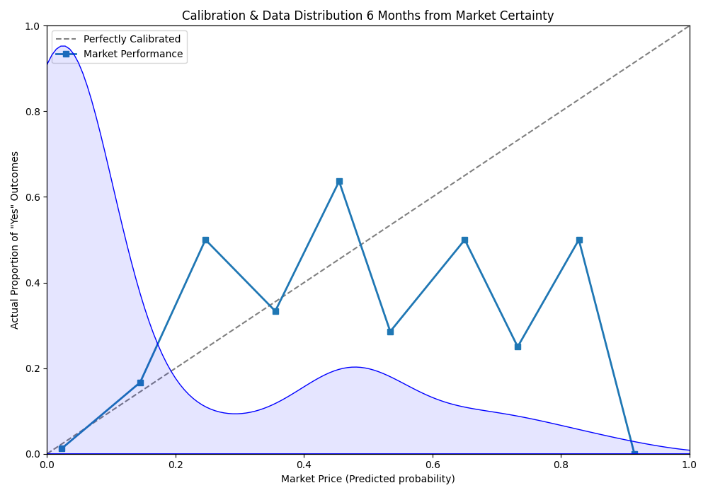
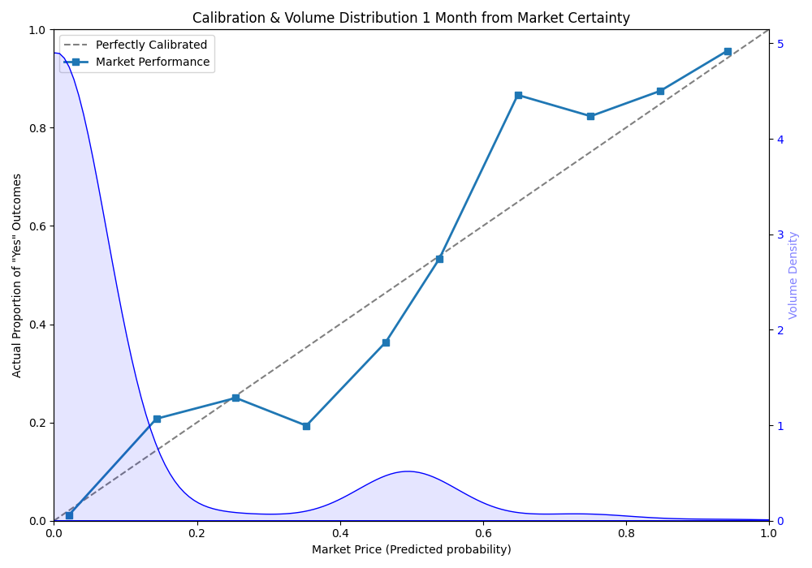
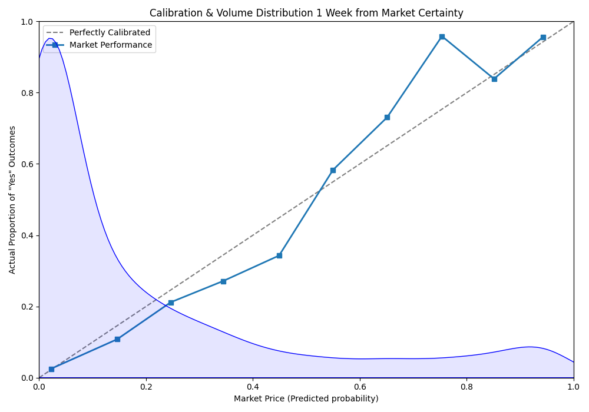
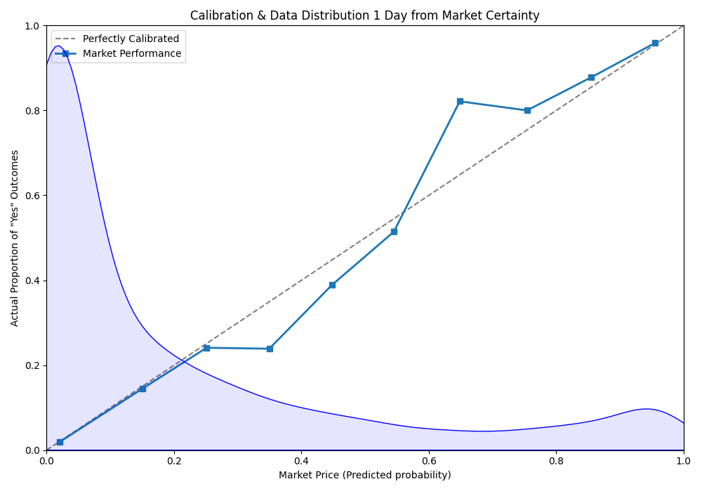
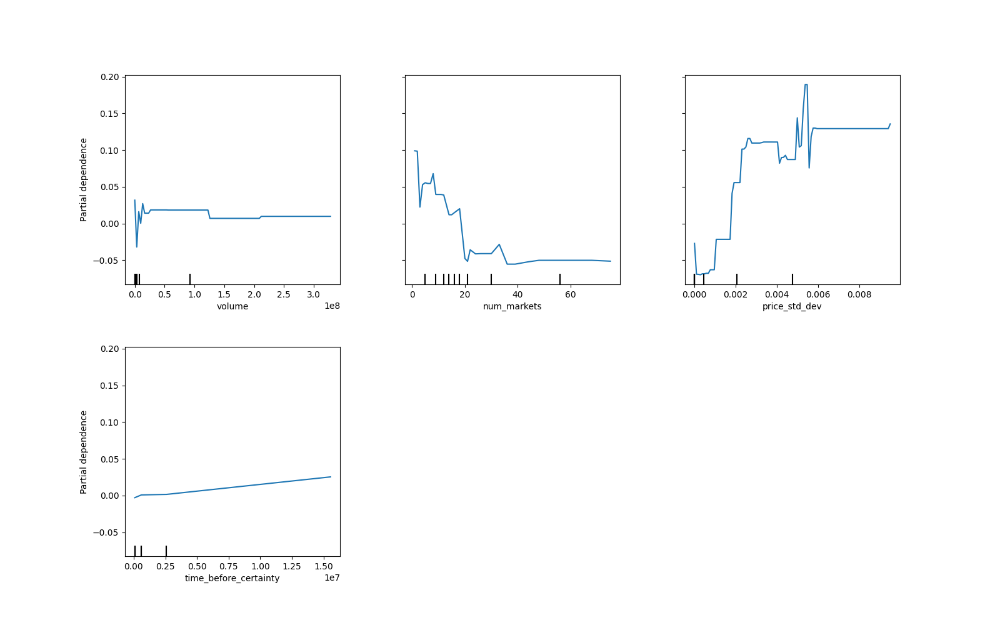

# Go with the safe bet - a Polymarket price analysis

Launched in June of 2020, Polymarket has taken off in popularity as an online space in which participants can bet on the real life outcomes of events, be it related to economics, geopolitics or sports. As of April 2026, the market reports [just under 700k monthly users](https://tokenterminal.com/explorer/projects/polymarket/metrics/user-mau). Unlike traditional betting platforms, odds are set by the many users trading on outcomes and not by a bookie. This is intended to make the odds fair and quickly updated. However, this is a claim and this blog seeks to verify whether it actually stacks up. By examining the price data around elections, suprisingly it appears that safe bets are significantly under valued. 

## What is Polymarket, and how does it work?

Polymarket is essentially a stock market in which users trade ‘Yes’ or ‘No’ predictions on events, rather than shares in companies. When an event has more than one outcome, (e.g. a political election between several candidates), then the question is split into several sub questions (e.g. will candidate X win). These questions together are referred to as the "markets" for an event. 

To create shares a user can "mint" a pair of "Yes" and "No" shares at any time before the event ends for $1. Additionally if a user has a pair of "Yes" and "No" shares at any time, they can redeem them for $1. Once an event is decided, either the "Yes" or "No" share can be redeemed for $1, depending on the winning outcome.

Due to the payout being strictly capped at $1.00, the current price of a share naturally translates into a percentage probability. Upon the understanding that thousands of people are risking their money on these predictions, then, it should follow that the percentage equivalent of the price (e.g., 80% probability if the price settles at $0.80 per share), is the real-time probability of that outcome actualising. 

## The polymarket API

Due to all trades in polymarket being performed on an open blockchain (however it could just as easily be done without one), the historical pricing data and trades on outcomes on events is open for all to see. Rather than have all users crawl through the blockchain's history, polymarket offers an [API](https://docs.polymarket.com/api-reference/introduction) that allows you to fetch most of the historical data assosciated with events. This API was used as the source of data for this analysis.

## Some pre-definitions

Before delving into the graphs that provide insight to the questions above, the definition of "market certainty" must be introduced. Market certainty, in this blog, refers to the point in time when the outcome of a prediction market is effectively known, even if the market has not yet officially resolved. That is to say, the point at which the price of a 'Yes' share is equal to $0.99.

Because this data is based purely on elections, the vast majority of elections do not result in the winning leader or party taking power the second an election winner is called. However events need a set point in time to resolve. Therefore events are set to end at a point in time past when the outcome will effectively be known so it can be certain the event will be resolved.

By making the analysis depend on the moment of certainty, rather than just the end date of the event, a much clearer picture of when the outcome is effectively known can be obtained. As data past this point is always going to be a flat 99% it provides not meaningful insight.

### Predition price calibration curves

One tool which can be used to gain insight to the accuracy of Polymarket's predictions is a calibration curve. A perfectly calibrated market, in this case, follows the identity line (at which point Polymarket’s predicted outcomes are equal to the average actual outcome i.e. markets priced at $0.70, should on average occur exactly 70% of the time in the real world). As it is based on probability, the more data you have, the more accurately the calibration curve describes the outcome. Therefore the calibration curve has been overlapped with a kernel density plot, to show the distribution of the input data. e.g. if the curve is high at $0.50, that means a lot of markets are priced at $0.50, and the more data at a certain probability the more accurate the curve will be at that point.

For example, there are not many events that spanned 6 months or longer, and therefore there is not as much price data for prices 6 months from an election. Many markets that were active 1 day before market certainty, did not exist 6 months before, which means the 6 months curve is nowhere near as accurate as the 1 day curve. 

Above, is a visualisation of the market’s actual performance 6 months out as shown by the blue line. The significant erraticism of the blue line 6 months from market certainty is likely due to the lack of data, of which this analysis only obtained 122 samples.

As time before certainty moves from from 1-month to 1-week, the blue line begins to hug the diagonal line much more tightly, as there is significantly more data. In the 1-week graph, accuracy is high across almost all price bins.
 

In all of the graphs, regardless of point in time, there is a massive concentration of volume near the zero-point, indicating that a substantial portion of market activity is dominated by "long-shot" bets on unlikely outcomes. This distribution highlights a speculative environment, where traders are more willing to risk capital on extreme probabilities as the return would be greater, were their prediction correct.

The final calibration graph, taken 1 day before certainty, follows a similar pattern to those above.

Even 1-day before market certainty, there apprears to be a significant underestimation of the favourite, as is represented by the vertical distance above the diagonal line at 0.65 (the market predicts a probability of 65%, but actual outcome probability is 80%).

This spike tells us that the market suffers from a cautionary lag and is not truly efficient just before an election outcome, otherwise the blue square would be sitting on the diagonal. 

The existence of this gap suggests that for mid-to-high probability events, the "Wisdom of the Crowd" is occasionally too conservative, perhaps fearing a "last-minute upset" that statistically rarely occurs. 

Therefore if this data is truly representative, in the short-term run-up to an election, if the ‘Yes’ price sits at roughly $0.65, one generally has an 80% chance of a return on their bet. 

Therefore, it suggests that a profitable trading strategy for election betting is to buy ‘Yes’ shares that are priced above the value of $0.65 (on the basis that this is within a month of the market certainty).

### Feature Importance

While calibration curves show us if prices are accurate, they don't tell us what the markers of innacuracy are. This can instead be modelled to attempt to identify which variables are the strongest predictors of an inaccurate market price. This analysis was performed using a gradient boosting regressor, with 100 estimators. After training the model, the effects on accuracy are mapped out for of each of the input variables. In the graphs below, a positive y value indicates that the variable at that x value in the dataset contributed to higher innacuracy while a negative value indicates it contributed to lower innacuracy.
 

The graphs above depict total money traded (volume), complexity of events (num_markets), volatility (price_std_dev), and time to market certainty (time_before_certainty).

As depicted above, volatility in prices is clearly the most influential driver shown in the set. As price volatility increases, the partial dependence on error climbs sharply from 0.00 to over 0.10, showing stability is the primary signal of accuracy: when the price swings wildly, the market's predictive error spikes significantly.

The effect of volume is relatively flat compared to volatility. There is a small initial spike near zero, but once a baseline level of total money traded is reached, the partial dependence on error remains fairly constant. This indicates that while 'quiet' markets are risky, after a certain threshold more money traded does not significantly improve accuracy.

The graph visualising market complexity's (num_market) effect on pricing error shows that as market complexity increases the more likely the price of one of it's outcomes are to be accurate. This may appear counter-intuitive at first however, it is likely explained by the fact that most markets with many outcomes have many outcomes that are very low probability. Since the error being measured is absolute error, the pricing between 0.01 and 0.02, although very signicant proportionally is not significant to the model.

The plot on time before market certainty, on the other hand, shows a steady, linear increase in error over time from the point of market certainty. This reinforces the earlier calibration analysis: the further out you are from an election result (measured in seconds/minutes on the x-axis), the less accurate the market price becomes, though the effect is minute in relation to volatility.

## Conclusion

- There is a consistent 'cautionary lag' where the market underestimates favourites; specifically, outcomes priced at 0.65 often carry a real-world probability closer to 80%. 
- Price volatility—rather than trading volume—is the strongest predictor of inaccuracy. 
- To maximize returns, the data suggests a "safe bet" strategy: favour stable, high-probability outcomes (>$0.65) within a month of the event, as the crowd often overestimates the likelihood of a last-minute upset.

To confirm the hypothesised "safe bet" strategy, a historical simulation of the markets could be created and a trading bot added that automatically buys a “Yes” share whenever the market’s favourite is priced at around $0.65, within a month of the expected market certainty. If the results of this analysis turn out to be true, it would be expected for the bot to make an average return of ~20% per event it trades on.